# B45 Labs — Revit Add-in

> B45 Labs is a productivity-focused Autodesk Revit add-in designed to streamline **coordination**, **auditing**, **documentation**, and **QA/QC** workflows for BIM teams.

> **Brand note:** Previously released as **BIM Genie**, rebranded to **B45 Labs**.

---

## 💛 Support This Project

B45 Labs is **free to use**. If it saves you time, consider supporting its development:

Your contributions help keep the project alive and growing. Thank you!

---

## 📸 Overview

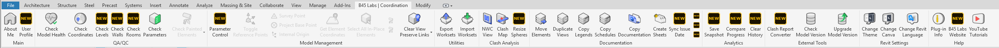
*Full ribbon tab — all commands organized by category (QA/QC, Model Management, Utilities, Clash Analysis, Documentation, Analytics, External Tools, Settings).*

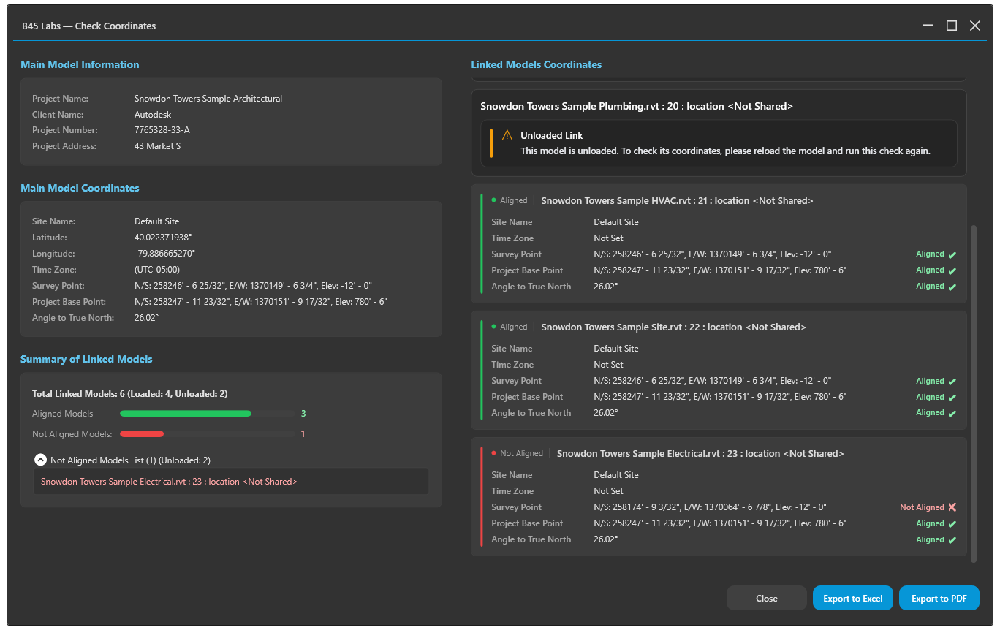
*Check Coordinates — validates Survey Point, Project Base Point, and Angle to True North across the main model and linked models. Aligned / Not Aligned / Unloaded states are color-coded for quick scanning.*

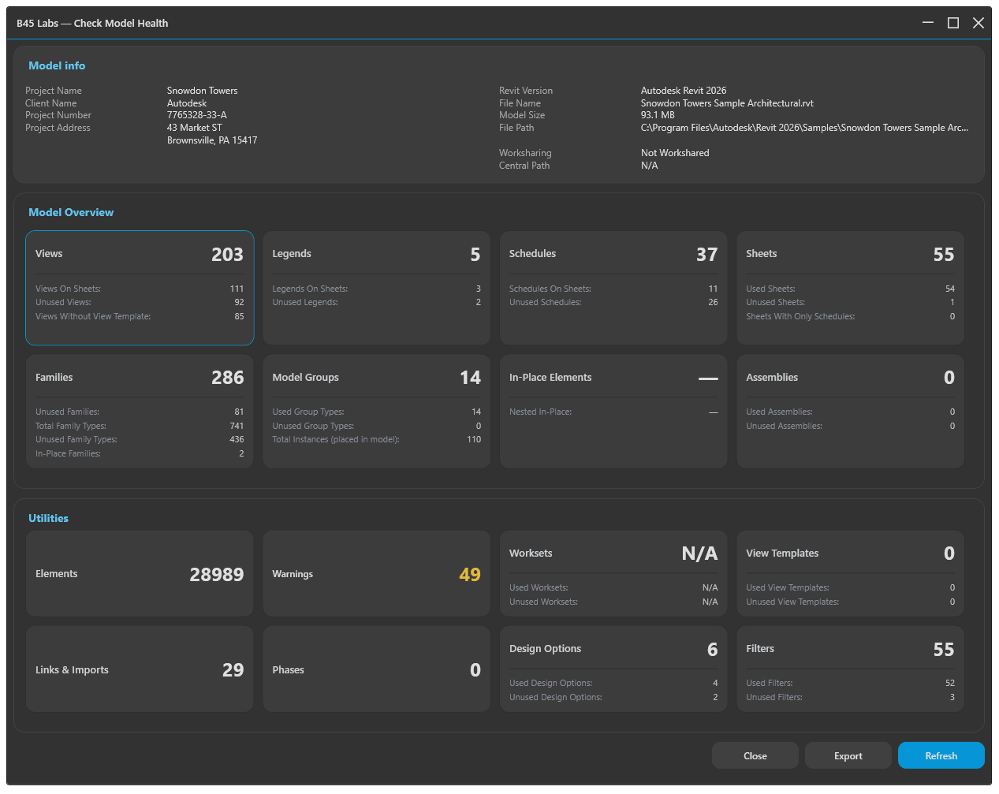
*Check Model Health — full model audit with breakdown by category.*

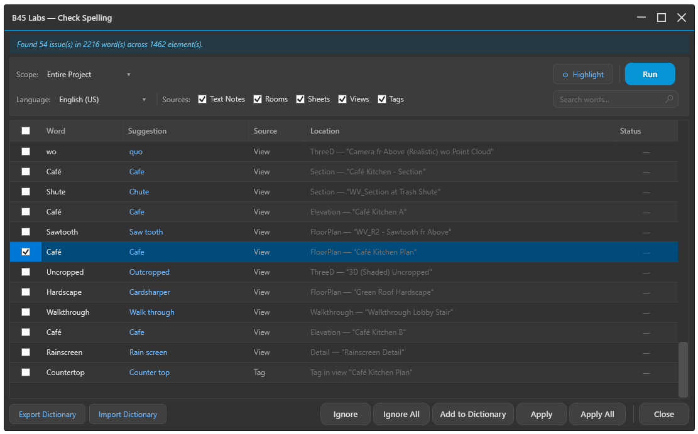
*Check Spelling — offline spell-check across Text Notes, Rooms, Sheets, and View Names. Dictionary support for English, Portuguese, and Spanish with a custom BIM vocabulary filter.*

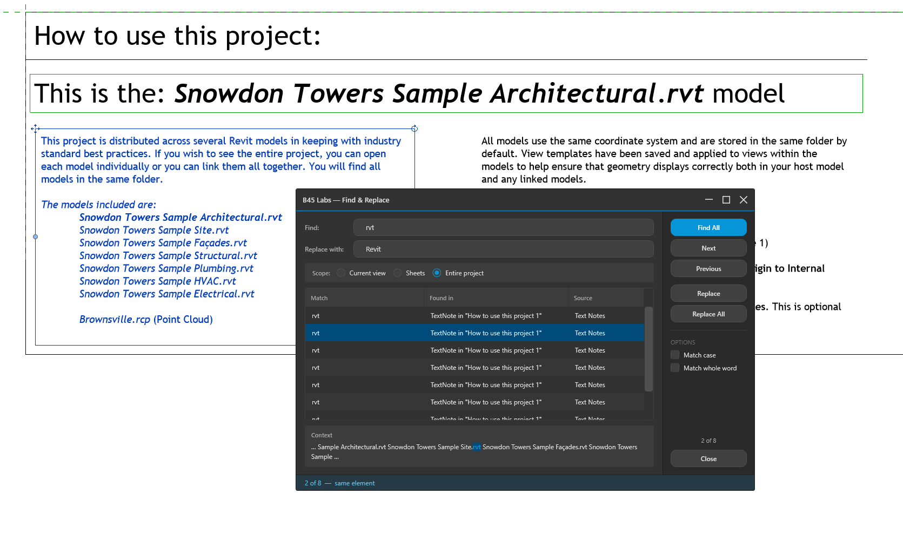
*Find & Replace — batch find and replace text across the model with scope controls (Current view / Sheets / Entire project), Sheet Set filtering, case and whole-word options, and a live results grid.*

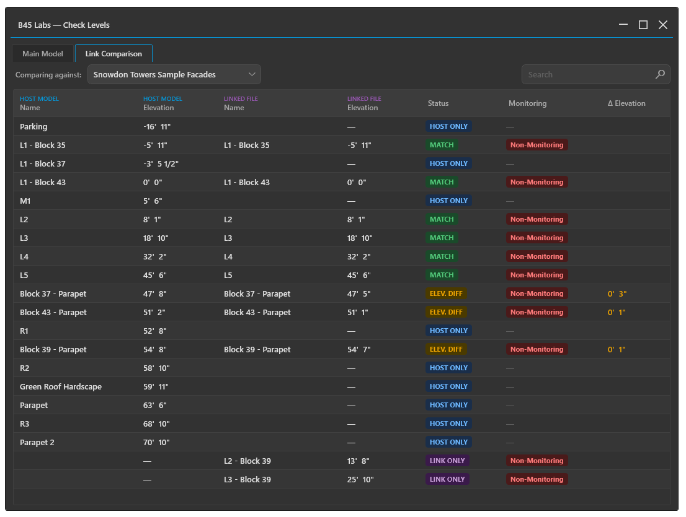
*Check Levels — validates level naming, elevation consistency, and ordering across the project.*

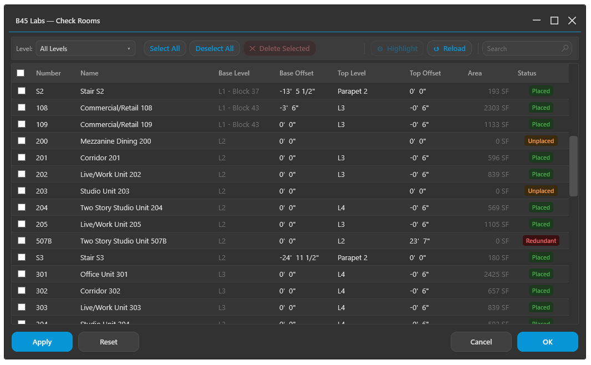
*Check Rooms — room naming, area, and placement validation.*

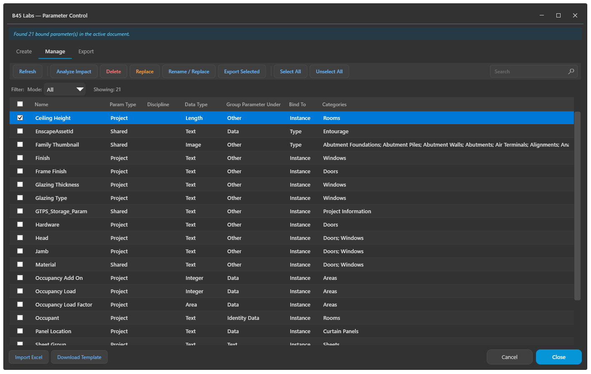
*Parameter Control — create, manage, and export shared and project parameters across categories without leaving Revit.*

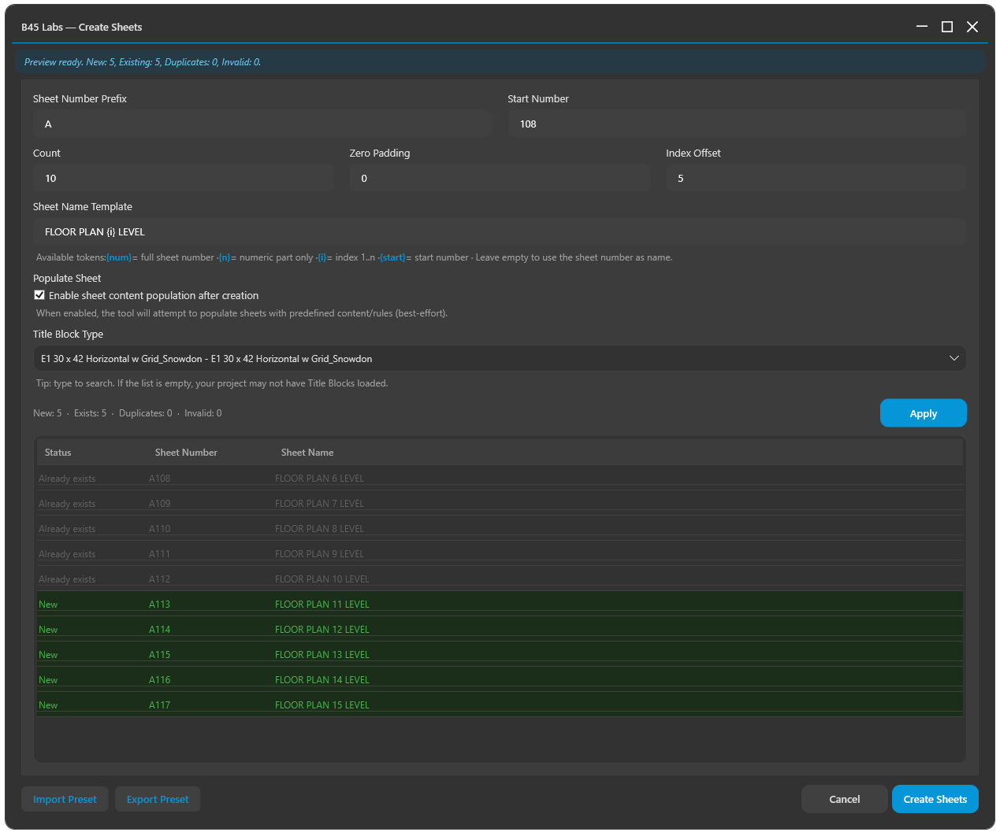
*Create Sheets — batch sheet creation from a template list.*

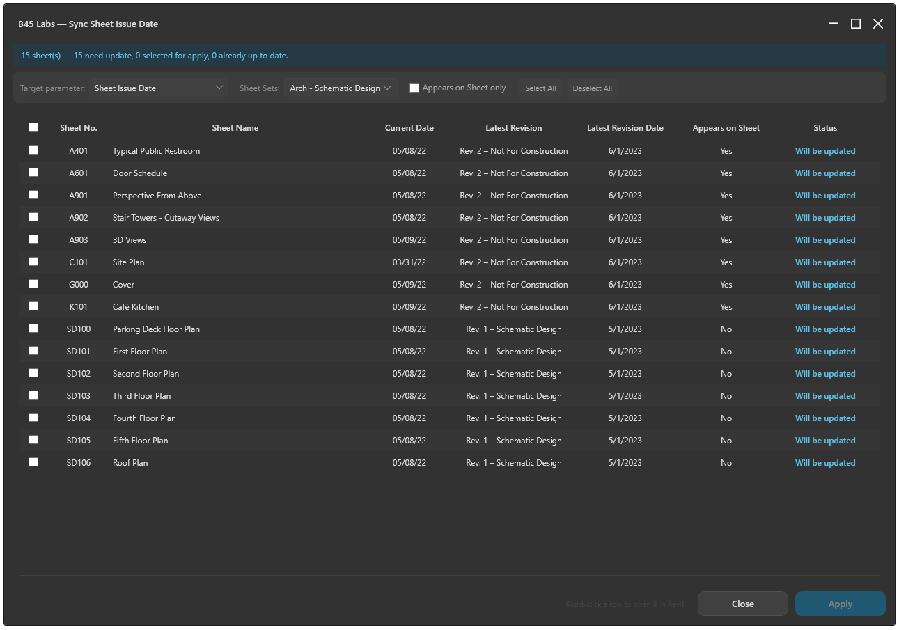
*Sync Sheet Issue Date — batch-update the issue date parameter across sheets based on the latest revision.*

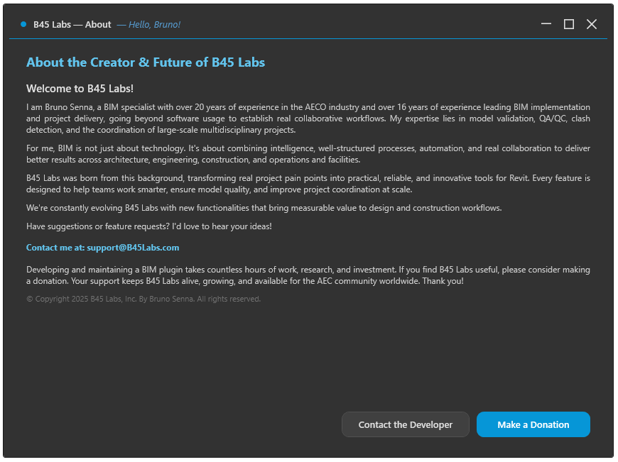
*User Profile — personalize your B45 Labs experience with name, role, experience with Revit, and discovery tags.*

---

## ✨ Key Features

### 🔍 QA/QC
- Coordinate validation across main model and linked models
- Model health checks and diagnostics
- Level, wall, and room validation
- Parameter and content auditing
- Painted-element detection

### 📄 Documentation
- Check Spelling across Text Notes, Room Names, Sheet Names, and View Names
  (offline dictionaries for English, Portuguese, and Spanish)
- Find and Find & Replace across model text with scope and Sheet Set filters
- Batch view, schedule, legend, and sheet utilities
- Sheet issue date synchronization
- Copy sheets and documentation content from another open model

### ⚙️ Model Management
- Parameter Control — shared and project parameters, batch-create and export
- Check and upgrade external Revit file versions (works even without a model open)
- Export/import worksets
- Select and manage in-place elements

### 🎯 Clash Analysis
- NWC View generation
- Clash Map from Navisworks exports
- Resize Clash Spheres

### 📊 Analytics
- Model Progress Analyzer — capture snapshots of key metrics and track the
  model's evolution over time

### 👤 User Profile
- Name, preferred name, email, company, role, experience with Revit, and how
  you found us (multi-select discovery tags with optional free-text details)
- Avatar and greeting personalized with your preferred name
- Saved locally in `%AppData%\B45Labs\user-profile.json`

---

## 📋 Requirements

| Requirement | Details |
|---|---|
| Autodesk Revit | 2023, 2024, 2025, 2026 *(full support)* · 2027 *(Beta)* |
| Operating System | Windows |
| .NET | net48 (R23/R24) · net8.0-windows (R25/R26) · net10.0-windows (R27 Beta) |
| Admin rights | May be required depending on install location |

---

## 📦 Installation

### Option A — Installer *(recommended)*
1. Download the latest installer from [**Releases**](https://github.com/Bruno-Senna/B45Labs/releases).
2. Close Revit before installing.
3. Run the installer and follow the setup wizard.
4. Launch Revit and open the **B45 Labs** ribbon tab.

### Option B — Manual
1. Copy the add-in bundle (DLLs + dependencies) to your target directory.
2. Place the `.addin` manifest in the Revit Addins folder.
3. Ensure dependencies are present and unblocked by Windows.

> **Note:**
> Revit 2023 and 2024 use the `net48` build.
> Revit 2025 and 2026 use the `net8.0-windows` build.
> Revit 2027 (Beta) uses the `net10.0-windows` build.

---

## 🛠️ Commands

### QA/QC
| Command | Description |
|---|---|
| Check Coordinates | Validates Survey Point / Project Base Point / True North across links |
| Check Model Health | Full model health audit with category breakdown |
| Check Levels | Level naming, elevation, and ordering |
| Check Walls | Wall types, constraints, and structural parameters |
| Check Rooms | Room naming, area, and placement |
| Check Parameters | Parameter auditing by category |
| Check Painted Elements | Detects painted materials |

### Documentation
| Command | Description |
|---|---|
| Check Spelling | Offline spell-check across text parameters (EN, PT, ES) |
| Find | Quick single-term search across model text |
| Find & Replace | Batch find and replace across parameters and elements |
| Move Elements | Batch move viewports / elements between sheets |
| Duplicate Views | Duplicate views with options |
| Copy Legends | Copy legends across sheets |
| Copy Schedules | Copy schedules across sheets |
| Copy Documentation | Copy sheet + drafting view content from another open model |
| Create Sheets | Batch sheet creation |
| Sync Sheet Issue Date | Batch-update issue date across sheets |

### Model Management
| Command | Description |
|---|---|
| Parameter Control | Create, manage, and export shared / project parameters |
| Toggle Reference Points | Show/hide Survey, Base, and Internal Origin |
| Get Element Coordinates | Precise element coordinates |
| Select All In-Place Elements | Batch select in-place families |
| Export / Import Worksets | Excel-based workset management |

### Analytics
| Command | Description |
|---|---|
| Model Progress Analyzer | Snapshot-based tracking of model evolution |

### External Tools
| Command | Description |
|---|---|
| Check Model Version | Inspect Revit version of external files *(no model required)* |
| Upgrade Model Version | Batch-upgrade external files *(no model required)* |

---

## 🔄 Updates

B45 Labs includes a built-in update check. When a new version is available, you'll be notified inside Revit.

Download the latest version from [**Releases**](https://github.com/Bruno-Senna/B45Labs/releases).

---

## 📊 Telemetry

To improve stability and prioritize development, B45 Labs collects limited, non-sensitive usage signals:
- Commands executed and usage counts
- Error logs and stack traces
- Add-in version, build number, and Revit version
- Approximate region (country/region, derived from IP — IP is not stored)
- Anonymous installation and session identifiers

Optionally, if you fill out the User Profile, we also collect: name, preferred
name, email, company, role, experience with Revit, and how you found us.

No model data, file paths, file contents, geometry, passwords, or device information is collected.
See [PRIVACY.md](PRIVACY.md) for full details.

---

## 📚 Documentation

| Document | Description |
|---|---|
| [TERMS.md](TERMS.md) | Terms of Use / EULA |
| [PRIVACY.md](PRIVACY.md) | Privacy Policy |
| [EULA_B45Labs.md](EULA_B45Labs.md) | Full End User License Agreement |
| [CHANGELOG.md](CHANGELOG.md) | Version history |
| [THIRD_PARTY_NOTICES.md](THIRD_PARTY_NOTICES.md) | Open-source licenses |
| [SUPPORT.md](SUPPORT.md) | Support information |
| [SECURITY.md](SECURITY.md) | Security policy |

---

## 🆘 Support

Email: **support@B45Labs.com**

When reporting issues, please include:
- B45 Labs version (e.g., 1.1.0)
- Revit version (2023 / 2024 / 2025 / 2026 / 2027 Beta)
- Steps to reproduce
- Screenshot (redact sensitive details)

---

## ©️ Copyright

Copyright (c) 2026 B45 Labs. All rights reserved.
Use of this Software is governed by [TERMS.md](TERMS.md).
